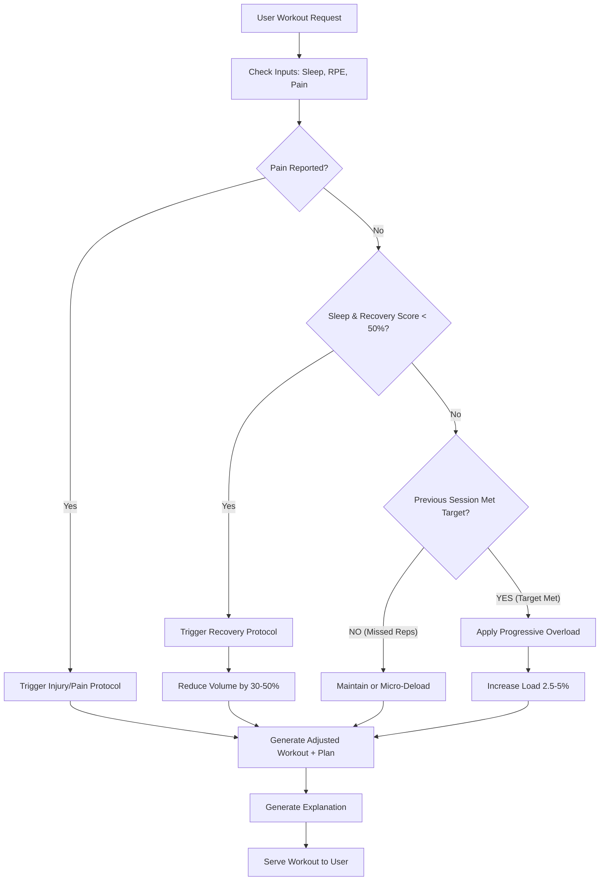

# Adaptive Training Engine - Design Document

This document outlines the architecture and decision logic for an MVP Adaptive Training Engine.

## 1. Decision Flow Logic

The core decision loop runs daily (or pre-workout) to determine the "Readiness Score" and "Session Adjustments".



## 2. Core Adjustment Engine (Pseudocode)

The engine prioritizes **Consistency > Intensity > Volume**.

### Inputs
- **`user_profile`**: Training maxes, injury history.
- **`session_feedback`**: RPE (1-10), sleep_quality (1-5), soreness (1-5), pain_flags (body_part).
- **`last_workout`**: Exercises performed, actual sets/reps/weight.

### Logic (Pseudocode)

```javascript
/* 
  Calculates a Daily Readiness Score (0-100)
  Basline is 80. Sleep and Soreness modify it.
*/
function calculateReadiness(sleep, soreness, stress) {
    let score = 80; // Start at baseline
    
    if (sleep < 5) score -= 20;
    else if (sleep < 7) score -= 10;
    else if (sleep > 8) score += 5;
    
    if (soreness > 3 && soreness <= 4) score -= 10; // High soreness
    if (soreness === 5) score -= 30; // Extreme soreness
    
    if (stress === 'High') score -= 15;
    
    return Math.max(0, Math.min(100, score));
}

/*
  Adjusts the upcoming session based on readiness and past performance.
*/
function adjustSession(plannedSession, readiness, lastSession) {
    let adjustments = [];
    
    // 1. Safety Check (Pain)
    if (lastSession.pain_reported) {
         return {
             type: 'INJURY_PROTOCOL',
             modifications: substituteExercises(plannedSession, lastSession.pain_area),
             explanation: `Due to reported pain in ${lastSession.pain_area}, we've swapped relevant exercises to lower impact alternatives.`
         };
    }

    // 2. Recovery Check (Readiness)
    if (readiness < 40) {
        // Deep fatigue state
        return {
            type: 'RECOVERY_DELOAD',
            modifications: reduceVolume(plannedSession, 0.5), // Cut volume by 50%
            explanation: "Your recovery scores are very low (Sleep + Stress). We've reduced volume by 50% today to prevent burnout and prioritize recovery."
        };
    } else if (readiness < 60) {
        // Moderate fatigue
        return {
            type: 'AUTOREGULATION_DOWN',
            modifications: reduceVolume(plannedSession, 0.2), // Cut volume by 20%
            explanation: "Recovery is slightly compromised. We've reduced total sets by 20% to keep you moving without overreaching."
        };
    }

    // 3. Progression Check (Performance)
    // For each exercise in the planned session:
    plannedSession.exercises.forEach(exercise => {
        let lastPerformance = getLastPerformance(exercise.id);
        
        if (!lastPerformance) return; // New exercise, stick to plan
        
        if (lastPerformance.rpe < 7 && lastPerformance.completed_reps >= lastPerformance.target_reps) {
             // Too easy, increase load
             exercise.weight *= 1.025; // +2.5%
             adjustments.push(`Increased ${exercise.name} weight by 2.5% (RPE was low).`);
        } else if (lastPerformance.rpe > 9 || lastPerformance.completed_reps < lastPerformance.target_reps) {
             // Too hard, maintain or back off
             exercise.weight *= 0.95; // -5% if failure reached
             adjustments.push(`Decreased ${exercise.name} weight by 5% to reset form and confidence.`);
        }
    });

    if (adjustments.length > 0) {
        return {
             type: 'PROGRESSION',
             modifications: plannedSession,
             explanation: "Great work last session! " + adjustments.join(' ')
        };
    }

    return {
        type: 'MAINTENANCE',
        modifications: plannedSession,
        explanation: "Sticking to the plan. Consistency is key right now."
    };
}
```

## 3. Example User Scenarios

### Scenario A: The "Ideal" Progression
*   **User**: Slept 8 hours, reported Low Stress. Last workout: Squat 3x5 @ 100kg (RPE 7).
*   **System Response**:
    *   **Readiness**: 95/100 (High)
    *   **Logic**: Recovery is optimal + Last session was RPE 7 (Sub-maximal). Target RPE is 8.
    *   **Adjustment**: Increase Load by 2.5% -> 102.5kg.
    *   **Explanation**: "Your recovery is excellent and last session's Squat was moved with good speed (RPE 7). We're bumping the weight to 102.5kg to drive strength adaptations."

### Scenario B: The "High Stress" Day
*   **User**: Slept 5 hours, reported High Stress (Work deadline).
*   **System Response**:
    *   **Readiness**: 45/100 (Low-Moderate)
    *   **Logic**: Readiness < 60 threshold triggers Volume Reduction.
    *   **Adjustment**: Remove 1 set from all compound lifts. Accessory work converted to "Optional".
    *   **Explanation**: "Sleep and stress are impacting your recovery today. We've removed 1 set from main lifts to reduce systemic fatigue while keeping the intensity high. Get in, hit it hard, and get out to recover."

### Scenario C: The Injury Workaround
*   **User**: Reports "Mild Knee Pain" (3/10) during Warmup.
*   **System Response**:
    *   **Logic**: Pain flag detected linked to "Knee".
    *   **Adjustment**: Substitute "Barbell Squat" (High axial load/knee flexion) with "Box Squat" (limited ROM) or "Glute Bridge" (Posterior chain focus, sparing knee).
    *   **Explanation**: "You flagged knee discomfort. We've swapped Squats for Glute Bridges today to train the legs without aggravating the joint. If pain persists > 24hrs, please rest."

## 4. Transparency Layer (Sample Explainer Text)

**Template Structure:**
`[Status Indicator] + [The "Why" (Data context)] + [The "What" (Adjustment)] + [The "Outcome" (Prediction)]`

**Examples:**
- **Load Increase**: "🚀 **Go Mode**: You crushed the last session (RPE 6). We're adding 2.5kg to keep you in the growth zone. Expect this to feel like an RPE 8."
- **Volume Decrease**: "🔋 **Energy Saver**: Short sleep (5h) means recovery is expensive today. We cut 2 sets to prevent overtraining. You'll stimulate muscle without digging a hole."
- **Deload**: "🛑 **Deload Week**: You've trained hard for 4 weeks straight. Performance is stalling. We're dropping intensity by 40% this week to let your nervous system rebound. You'll come back stronger next week."
